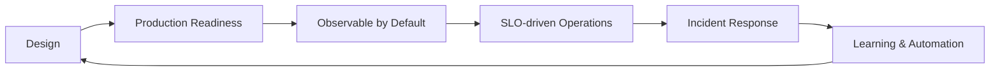

# Marco Cristofolini

**Principal / Staff Site Reliability Engineer · Platform Engineering · Kubernetes · Cloud · Observability**

[Português](README_PT-BR.md)

I build reliable platforms and production systems with a focus on **Kubernetes, cloud infrastructure, observability, developer experience and incident automation**.

My engineering interests sit at the intersection of **SRE, Platform Engineering, Production Engineering and AI-assisted operations**.

[LinkedIn](https://www.linkedin.com/in/marcocristofolini/) · [GitHub](https://github.com/marcocristofolini)

## Engineering portfolio

| Project | What it demonstrates |
|---|---|
| [kubernetes-rca-engine](https://github.com/marcocristofolini/kubernetes-rca-engine) | Evidence-driven Kubernetes incident analysis and automated RCA |
| [production-readiness-framework](https://github.com/marcocristofolini/production-readiness-framework) | SLOs, failure modes, overload protection and operational readiness |
| [platform-engineering-reference](https://github.com/marcocristofolini/platform-engineering-reference) | Kubernetes platform architecture, GitOps and developer self-service |
| [observability-stack](https://github.com/marcocristofolini/observability-stack) | OpenTelemetry-first metrics, logs and traces |
| [kubernetes-sre-playbook](https://github.com/marcocristofolini/kubernetes-sre-playbook) | Reproducible Kubernetes failures, signals and runbooks |
| [terraform-cloud-platform](https://github.com/marcocristofolini/terraform-cloud-platform) | Production-oriented Terraform / OpenTofu patterns |

## Core areas

**Reliability Engineering**  
SLIs · SLOs · Error Budgets · Incident Response · Production Readiness · Capacity Planning · Load Shedding · Graceful Degradation

**Platform Engineering**  
Kubernetes · EKS · AKS · GKE · Backstage · GitOps · Argo CD · Flux · Helm · Karpenter · KEDA

**Cloud & Infrastructure**  
AWS · Azure · Google Cloud · Terraform · Terragrunt · OpenTofu · Pulumi · Crossplane

**Observability**  
OpenTelemetry · Prometheus · Grafana · Thanos · Loki · Tempo · Datadog · New Relic · Zabbix

**Distributed Systems**  
Kafka · RabbitMQ · NATS · Redis · PostgreSQL · MySQL

**Networking & Service Mesh**  
Istio · Linkerd · Cilium · Calico · NGINX Ingress · Consul

## How I approach production systems

I care about systems that are measurable, observable, resilient under partial failure, safe to operate and easy for developers to use.

## Current focus

I am especially interested in reducing incident investigation time by correlating **Kubernetes state, events, metrics, logs, traces and topology** into evidence-backed hypotheses rather than relying on opaque AI guesses.

That work is represented in [kubernetes-rca-engine](https://github.com/marcocristofolini/kubernetes-rca-engine).
